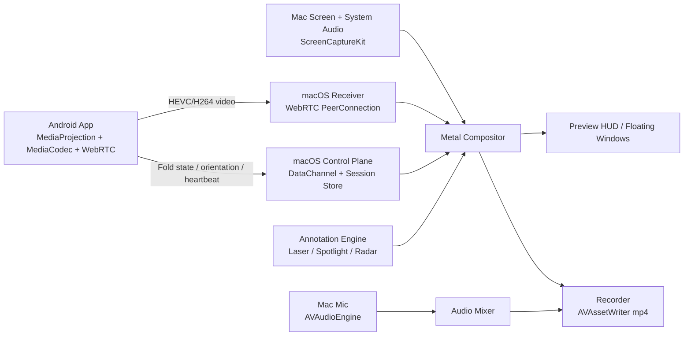

# Arquitectura V1: App Nativa macOS + Android para Grabación y Mirroring Táctico

## 1. Resumen Ejecutivo

La v1 debe ser una herramienta nativa de alto rendimiento para:

- capturar la pantalla del Mac,
- recibir en vivo la pantalla de un Android por Wi-Fi local,
- componer ambos mundos en una sola escena visual,
- superponer anotaciones neón efímeras,
- y exportar un video final en `mp4` a `1440p60` como modo por defecto, con `4K60` como modo avanzado.

La decisión central es esta:

**la Mac no "graba la pantalla" como una app tradicional; la Mac renderiza una escena compuesta en GPU y esa escena es la que se graba.**

Eso nos permite mantener una identidad visual propia, baja latencia en preview y herramientas de anotación realmente premium.

## 2. Principios No Negociables

- `100% nativo`: `Swift + Metal` en macOS, `Kotlin` en Android.
- `LAN-first`: todo local, sin servidores externos en v1.
- `latencia objetivo preview`: `< 100 ms` p95 en red Wi-Fi local sana.
- `GPU-first`: evitar copias CPU innecesarias; la composición vive en Metal.
- `UX inmersiva`: glassmorphism oscuro, HUD flotante modular, neón táctico, feedback háptico y sonoro.
- `v1 brutalmente buena`: pocas features, pero ejecutadas con calidad obsesiva.

## 3. Alcance Real de la V1

### Incluido

- Captura de pantalla del Mac.
- Captura de audio del sistema del Mac.
- Captura de micrófono del Mac.
- APK Android que comparte pantalla en tiempo real al Mac.
- Vista del Android dentro de un marco de teléfono renderizado en la app de Mac.
- Soporte inicial para `Honor Magic V2` en modo plegado/desplegado y rotación.
- Morphing fluido del recuadro del teléfono al cambiar postura.
- Herramientas v1:
  - Lápiz Láser
  - Spotlight de Pulso
  - Puntero Radar
- Desaparición automática de anotaciones en `3-5 s`.
- Exportación final en `mp4`.

### Fuera de v1

- Control remoto completo del Android desde la Mac.
- Edición post-grabación.
- Nube, cuentas, sync, colaboración.
- Android audio capture dentro del stream principal.
- Flechas, rectángulos, círculos, texto y zoom semántico: se dejan para fase 2.

## 4. Decisión de Arquitectura

### Recomendación

Usar una arquitectura de dos apps con composición centralizada en Mac:

1. **Android Sender**
   - Captura pantalla con `MediaProjection`.
   - Codifica en hardware con `MediaCodec`.
   - Publica stream P2P por `WebRTC`.
   - Emite metadatos de postura/orientación por `DataChannel`.

2. **macOS Director**
   - Captura la pantalla y el audio del Mac con `ScreenCaptureKit`.
   - Recibe el stream Android por `WebRTC`.
   - Decodifica y convierte frames a textura.
   - Compone escena completa en `Metal`.
   - Mezcla audio del sistema + micrófono.
   - Codifica el video final con `AVAssetWriter`.

### Por qué esta arquitectura

- `WebRTC` ya resuelve muy bien el problema difícil de latencia, jitter, congestión y reconexión en streaming en tiempo real.
- `Metal` nos da control absoluto para la estética neón y el pipeline de composición.
- `ScreenCaptureKit` es la vía correcta en macOS moderno para captura de pantalla y audio de alto rendimiento.
- La escena final se renderiza una sola vez y sirve tanto para preview como para grabación, reduciendo divergencias visuales.

## 5. Diagrama de Alto Nivel



## 6. Cómo Resolver el Streaming `< 100 ms`

### Opción elegida para v1

`WebRTC nativo + LAN signaling propio + hardware encode/decode`.

### Flujo recomendado

1. La app de Mac anuncia un servicio local por `Bonjour`.
2. La APK descubre ese servicio en la misma red.
3. Android abre un canal de signaling local seguro hacia la Mac.
4. Se intercambian `SDP/ICE`.
5. La sesión `WebRTC` se establece en modo LAN-first, priorizando candidatos host locales.
6. El stream de video corre en `HEVC` preferido; `H.264` como fallback.

### Por qué no conviene inventar un protocolo propio en v1

Un pipeline custom sobre `UDP/QUIC` podría ser más extremo a largo plazo, pero retrasaría demasiado la v1. El cuello de botella real no es "tener protocolo propio"; es mantener:

- reconexión limpia,
- control de jitter,
- bitrate adaptativo,
- hardware codecs,
- sincronización,
- comportamiento decente en Wi-Fi real.

`WebRTC` ya entrega eso. El valor diferencial del producto no está en reinventar RTP; está en la experiencia visual, el compositor, la ergonomía y la sensación táctico-futurista.

### Presupuesto de latencia objetivo

| Etapa | Meta |
| --- | --- |
| Captura Android | `8-16 ms` |
| Encode hardware Android | `8-20 ms` |
| Transporte LAN | `5-15 ms` |
| Decode hardware Mac | `8-16 ms` |
| Composite Metal + present | `4-8 ms` |
| **Total preview típico** | **`33-75 ms`** |
| **Presupuesto p95** | **`< 100 ms`** |

### Reglas de rendimiento para lograrlo

- No transmitir la pantalla del Android a resolución nativa completa en v1.
- Perfil por defecto del stream Android: `1080p60`, bitrate adaptativo `8-20 Mbps`, screen-content tuning.
- HEVC primero en dispositivos compatibles; H.264 si la negociación o el hardware no cooperan.
- Mantener preview y recorder desacoplados por colas cortas: preview manda.
- Si el sistema entra en presión térmica, bajar primero resolución del stream Android antes que romper el preview.

## 7. Cómo Resolver el Renderizado Neón con Metal

### Idea central

Todo lo visual se dibuja en un compositor Metal con varias capas y efectos de postproceso baratos.

### Capas del frame

1. **Background layer**
   - textura de pantalla Mac capturada por `ScreenCaptureKit`.

2. **Android device layer**
   - textura del stream Android decodificado.
   - máscara redondeada.
   - bezel y cristal sintético renderizados como otra capa.

3. **Annotation layer**
   - primitivas vectoriales temporales con TTL.

4. **FX layer**
   - bloom/glow,
   - pulse spotlight,
   - radar waves,
   - glitch dissolve,
   - noise sutil,
   - data-rain opcional en el marco del teléfono.

5. **HUD layer**
   - paneles flotantes, drag handle, indicadores de grabación.

### Pipeline recomendado

#### Pass 1: Scene Composition

- pantalla Mac
- stream Android
- bezel base

#### Pass 2: Annotation Geometry

- líneas y curvas como strips o mallas simples
- distancia al trazo calculada en shader

#### Pass 3: Glow/Bloom

- render target auxiliar a media resolución
- blur separable horizontal/vertical
- mezcla aditiva sobre el frame final

#### Pass 4: Fullscreen FX

- spotlight mask
- radar ripples
- glitch dissolve basado en blue-noise + time threshold

#### Pass 5: UI/HUD

- overlays de control
- estados de grabación/sync

### Diseño de shaders v1

#### Lápiz Láser

- núcleo blanco.
- halo neón exterior basado en distancia al trazo.
- cola temporal de baja opacidad.
- fade-out por TTL con curva no lineal.

#### Spotlight de Pulso

- fullscreen dimmer.
- recorte circular o elíptico alrededor del foco.
- borde pulsante con sinusoide.
- opacidad exterior configurable.

#### Puntero Radar

- al click/tap se crea un evento con timestamp.
- shader dibuja una o más ondas expansivas.
- el borde de la onda tiene glow y leve aberración cromática.

#### Disolución/Glitch

- cada anotación tiene `birthTime` y `deathTime`.
- el fragment shader usa blue-noise o hash noise para romper el alpha en el tramo final.
- así desaparece con personalidad, no solo con un fade aburrido.

### Decisión crítica de implementación

Las anotaciones **no** deben pintarse como bitmap acumulado.  
Deben modelarse como entidades temporales:

- `stroke`
- `spotlight`
- `radarPulse`

Cada entidad guarda geometría, estilo, color, grosor y TTL. Esto hace posible:

- redibujar a cualquier resolución,
- exportar limpio,
- animar desaparición,
- soportar undo/clear luego sin rehacer la arquitectura.

## 8. Arquitectura macOS

### Shell de UI

- `SwiftUI` para pantallas, settings, onboarding y paneles declarativos.
- `AppKit` para ventanas flotantes, comportamiento tipo HUD, hotkeys, tracking fino y haptics.

### Subsistemas

#### 8.1 Capture Engine

- `ScreenCaptureKit`
- captura display/window selection
- captura audio del sistema
- salida de frames en `CMSampleBuffer`

#### 8.2 Android Receiver

- `WebRTC Obj-C SDK` en macOS
- decode hardware cuando el codec lo permita
- adaptación de frame a `CVPixelBuffer`/textura Metal

#### 8.3 Compositor

- `MetalKit` + `MTKView`
- command buffers dobles o triples
- texturas persistentes para:
  - mac screen
  - android frame
  - annotation buffer
  - bloom buffer

#### 8.4 Recorder

- `AVAssetWriter`
- `AVAssetWriterInputPixelBufferAdaptor`
- `mp4` con `H.264` o `HEVC` según preset
- reloj maestro de grabación desacoplado del render loop

#### 8.5 Audio Mixer

- `AVAudioEngine`
- entrada micrófono
- mezcla con audio del sistema capturado
- normalización ligera y limiter opcional en v1

#### 8.6 Sensory Feedback

- `NSHapticFeedbackManager` para feedback táctil en Mac con Force Touch trackpad compatible
- sonidos UI cortos precargados, disparados desde un motor de audio ligero

### Recomendación de ventanas

- ventana principal de preview/composición.
- paleta flotante modular.
- barra de estado minimal.

La paleta usa **drag handle de 3 barras** visible y táctico. No usar menú hamburguesa.

## 9. Arquitectura Android

### Shell de UI

- `Jetpack Compose` para setup, pairing, estados y controles.
- `Foreground Service` para streaming persistente.

### Subsistemas

#### 9.1 Screen Capture

- `MediaProjectionManager`
- `MediaProjection`
- `VirtualDisplay`

#### 9.2 Encoding

- `MediaCodec`
- preferencia por `HEVC`
- fallback a `H.264`
- modo de baja latencia

#### 9.3 Transport

- `WebRTC native`
- envío de video P2P
- `DataChannel` para:
  - orientación
  - posture
  - dimensiones actuales
  - latidos de sesión
  - eventos futuros de control remoto

#### 9.4 Fold Awareness

- `Jetpack WindowManager`
- `WindowInfoTracker`
- `FoldingFeature`

#### 9.5 Haptics / Sound

- `VibratorManager`
- `SoundPool` para clics/confirmaciones de baja latencia

### Nota importante sobre foldables

La API estándar de Android sí nos da `WindowLayoutInfo` y `FoldingFeature`, pero **no expone de forma uniforme un ángulo continuo de bisagra útil para animaciones perfectas en todos los OEM**.  

Por eso, en v1 recomiendo:

- detectar estados estables: plegado, desplegado, half-opened, rotación;
- transmitir esos cambios a la Mac;
- hacer el morphing suave del lado Mac con interpolación propia.

Eso produce una experiencia fluida sin depender de APIs vendor-specific del `Honor Magic V2`.

## 10. Integración del Honor Magic V2

### Estrategia

Crear un `DeviceProfile` específico para el `Honor Magic V2` con:

- aspecto plegado,
- aspecto desplegado,
- radios de esquina,
- márgenes internos del frame,
- presets de bezel.

### Detección

La APK envía:

- ancho/alto actuales,
- orientación,
- presencia/estado del `FoldingFeature`,
- si el layout actual es tipo teléfono o tipo tablet.

La Mac usa esos metadatos para cambiar entre:

- `phoneCompact`
- `phoneLandscape`
- `foldableOpenPortrait`
- `foldableOpenLandscape`

### Morphing recomendado

- interpolación por `spring` de `frame`, `cornerRadius`, `bezelWidth`, `glassReflection`.
- duración objetivo: `180-260 ms`.
- nunca hacer cut duro salvo pérdida de stream.

## 11. Modelo de Datos Compartido

Conviene definir un contrato de mensajes cross-platform desde el día 1.

### Recomendación

- `Protocol Buffers` para mensajes compartidos.

### Mensajes mínimos v1

- `SessionHello`
- `PairingState`
- `VideoStreamMeta`
- `DevicePostureChanged`
- `OrientationChanged`
- `Heartbeat`
- `ThermalWarning`

Esto mantiene Mac y Android alineados y evita que el proyecto derive hacia JSON improvisado por todas partes.

## 12. Stack Exacto Recomendado

## macOS

| Capa | Tecnología |
| --- | --- |
| Lenguaje | `Swift` |
| UI declarativa | `SwiftUI` |
| Ventanas/HUD/input fino | `AppKit` |
| Render / shaders | `Metal`, `MetalKit` |
| Captura pantalla/audio | `ScreenCaptureKit` |
| Video encode final | `AVFoundation`, `AVAssetWriter`, `VideoToolbox` |
| Audio mix | `AVAudioEngine`, `Core Audio` |
| Streaming receiver | `WebRTC Obj-C SDK` para macOS |
| Descubrimiento local | `Bonjour` / `Network framework` |
| Haptics | `NSHapticFeedbackManager` |
| Serialización | `SwiftProtobuf` |
| Telemetría | `os_log`, `os_signpost`, `Instruments` |
| Paquetes | `Swift Package Manager` |

## Android

| Capa | Tecnología |
| --- | --- |
| Lenguaje | `Kotlin` |
| UI | `Jetpack Compose` |
| Servicio persistente | `Foreground Service` |
| Captura de pantalla | `MediaProjection` |
| Encode hardware | `MediaCodec` |
| Streaming sender | `WebRTC native` |
| Fold awareness | `androidx.window` / `Jetpack WindowManager` |
| Haptics | `VibratorManager` |
| UI sounds | `SoundPool` |
| Serialización | `protobuf-kotlin-lite` |
| Concurrencia | `Kotlin Coroutines`, `Flow` |
| Build | `Gradle Kotlin DSL` |
| Profiling | `Android Studio Profiler`, `Perfetto`, `Macrobenchmark` |

## Herramientas de Proyecto

| Área | Recomendación |
| --- | --- |
| Repo | Monorepo |
| Formato | `swift-format`, `ktlint` |
| Lint | `SwiftLint`, `detekt` |
| CI futura | `GitHub Actions` |
| Benchmarks | suite local de latencia/render |

## 13. Estructura Inicial del Repositorio

```text
/docs
  v1-architecture-roadmap.md
/shared
  /proto
/mac
  /App
  /Capture
  /Streaming
  /Renderer
  /Annotations
  /Recorder
  /UI
/android
  /app
  /capture
  /streaming
  /foldable
  /session
  /ui
/bench
  latency
  render
  thermal
```

## 14. Roadmap por Fases

## Fase 0: Spike Técnico de Riesgo

### Objetivo

Probar que el corazón del producto es viable antes de diseñar demasiado.

### Entregables

- app mac mínima que renderiza una textura de prueba en `Metal`
- APK mínima que comparte pantalla a la Mac por LAN
- medición real de latencia preview
- prueba de captura Mac + stream Android simultáneos

### Exit criteria

- preview Android en Mac a `60 fps` con latencia típica `< 100 ms`
- captura de pantalla Mac corriendo al mismo tiempo sin stutter severo
- M1 Air estable durante una sesión de `10 min`

### Duración estimada

`5-7 días`

## Fase 1: Core de Grabación macOS

### Objetivo

Construir el esqueleto profesional del director de escena en Mac.

### Entregables

- ventana principal
- preview de pantalla capturada
- captura de audio sistema + mic
- recorder `mp4`
- panel flotante con HUD base

### Exit criteria

- grabación local `1440p60` estable
- sync A/V aceptable en sesiones de `20 min`
- CPU/GPU dentro de presupuesto razonable en M1 Air

### Duración estimada

`1.5-2 semanas`

## Fase 2: Android Sender + Pairing Local

### Objetivo

Tener la APK funcional y confiable en red local.

### Entregables

- permiso `MediaProjection`
- foreground service
- discovery local
- pairing one-tap
- stream Android visible en Mac
- sonidos y haptics básicos de conexión

### Exit criteria

- conexión repetible en misma red en menos de `5 s`
- reconexión limpia tras corte corto de red
- fallback a H.264 cuando HEVC falle

### Duración estimada

`1.5-2 semanas`

## Fase 3: Compositor Premium + Marco del Teléfono

### Objetivo

Convertir un preview técnico en una escena producto.

### Entregables

- integración de stream Android en el compositor
- marco de teléfono renderizado
- presets visuales compact/foldable
- morphing de estado para `Honor Magic V2`
- layout movable/resizable del recuadro

### Exit criteria

- transiciones sin black frames
- morphing percibido como fluido y premium
- drag/move del recuadro sin tearing visible

### Duración estimada

`1.5-2 semanas`

## Fase 4: Annotation Engine Futurista

### Objetivo

Entregar la capa de diferenciación real del producto.

### Entregables

- Lápiz Láser
- Spotlight de Pulso
- Puntero Radar
- TTL configurable `3-5 s`
- disolución/glitch
- atajos iniciales

### Exit criteria

- anotaciones a `60 fps`
- sin fugas visuales ni ghosting molesto
- preview y export final visualmente consistentes

### Duración estimada

`2 semanas`

## Fase 5: Pulido, Perfilado y Modo 4K

### Objetivo

Hacer que la v1 sea confiable y presentable.

### Entregables

- perfilado con `Instruments` y `Perfetto`
- thermal management
- preset `4K60`
- onboarding mínimo
- pantallas de permisos
- recoveries de error

### Exit criteria

- `1440p60` sólido como modo default
- `4K60` usable en sesiones cortas o controladas
- crash rate muy baja en pruebas internas

### Duración estimada

`1-2 semanas`

## Tiempo total estimado

### Fundador/solo builder con ayuda de IA

`8-10 semanas` para una v1 seria.

### Equipo pequeño de 2 personas

`5-7 semanas` si una persona lidera macOS/render y otra Android/streaming.

## 15. Presupuesto de Rendimiento

### Default shipping mode

- salida final: `2560x1440 @ 60 fps`
- stream Android: `1080p @ 60 fps`
- glow a media resolución
- layout Android ocupando hasta `25-35%` de la escena

### Modo avanzado

- salida final: `3840x2160 @ 60 fps`
- activar solo si:
  - energía conectada,
  - temperatura estable,
  - frame pacing sano.

### Observación honesta

El `MacBook Air M1` es muy capaz, pero es fanless.  
`4K60 + capture + stream decode + glow + recorder` es posible, pero no debe ser el preset por defecto en v1.  
La experiencia hero debe ser `1440p60`.

## 16. Riesgos Reales y Mitigaciones

### Riesgo 1: redes Wi-Fi malas

- síntoma: descubrimiento o latencia inestable
- mitigación:
  - LAN-first con fallback manual por IP
  - degradación adaptativa del stream Android
  - diagnóstico de red en settings

### Riesgo 2: variaciones OEM en foldables

- síntoma: postura ambigua o dimensiones raras
- mitigación:
  - heurística por `WindowMetrics`
  - `DeviceProfile` específico para Magic V2
  - override manual de perfil en settings de debug

### Riesgo 3: thermal throttling en M1 Air

- síntoma: caída de fps prolongada
- mitigación:
  - glow a media resolución
  - control de frame pacing
  - bajar primero stream Android antes que el canvas final

### Riesgo 4: sincronización A/V

- síntoma: drift tras sesiones largas
- mitigación:
  - clock maestro único en recorder
  - colas cortas y timestamping estricto
  - tests de sesiones largas

## 17. Recomendación Final de Producto

La mejor v1 no es "OBS pero más bonito".  
La mejor v1 es:

- grabación Mac impecable,
- mirroring Android inmediato,
- marco foldable premium,
- tres herramientas de anotación inolvidables,
- latencia que se siente casi instantánea,
- una identidad visual imposible de confundir.

Ese recorte produce algo vendible, demoable y técnicamente defendible.

## 18. Siguiente Paso Recomendado

El siguiente documento que conviene crear es un **Plan de Implementación Fase 0-1**, con:

- milestones semanales,
- contratos `proto`,
- módulos del repo,
- decisiones de UI state,
- y criterios exactos de benchmark.

## 19. Referencias Oficiales

- Apple `ScreenCaptureKit`: <https://developer.apple.com/documentation/screencapturekit/>
- Apple `Capturing screen content in macOS`: <https://developer.apple.com/documentation/screencapturekit/capturing-screen-content-in-macos>
- Apple `Metal`: <https://developer.apple.com/documentation/Metal>
- Apple `Bonjour`: <https://developer.apple.com/bonjour/>
- Apple `NSHapticFeedbackManager`: <https://developer.apple.com/documentation/appkit/sound-speech-and-haptics>
- WebRTC overview: <https://webrtc.org/>
- WebRTC native Obj-C SDK: <https://webrtc.googlesource.com/src/+/refs/heads/main/sdk/objc/>
- Android `MediaProjectionManager`: <https://developer.android.com/reference/android/media/projection/MediaProjectionManager>
- Android capture video/audio playback: <https://developer.android.com/media/platform/av-capture>
- Android fold-aware apps: <https://developer.android.com/develop/ui/compose/layouts/adaptive/foldables/make-your-app-fold-aware>
- Android `VibratorManager`: <https://developer.android.com/reference/android/os/VibratorManager>
